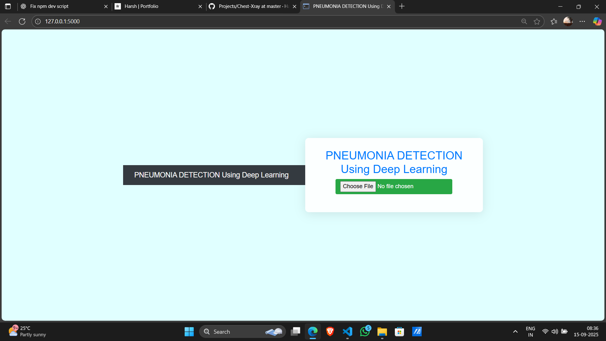

This project is a web-based application built with Flask that detects pneumonia from chest X-ray images using a trained deep learning model.
It uses TensorFlow and Keras to classify uploaded X-rays as either Normal or Pneumonia. Users can upload chest X-ray images through a simple web interface, and the system will return the prediction along with a confidence score.
This tool is designed to support faster, AI-assisted medical diagnosis.

It Run app.py under Flask application

Model link= https://drive.google.com/file/d/18tkT_AXnrzZp38S4A9y2ztbsbYuMrxCy/view?usp=drivesdk

Note= Update Path in app.py

### Screenshots

### 🏠 Home Page

### 📊 Prediction

### Normal

### Pneumonia

